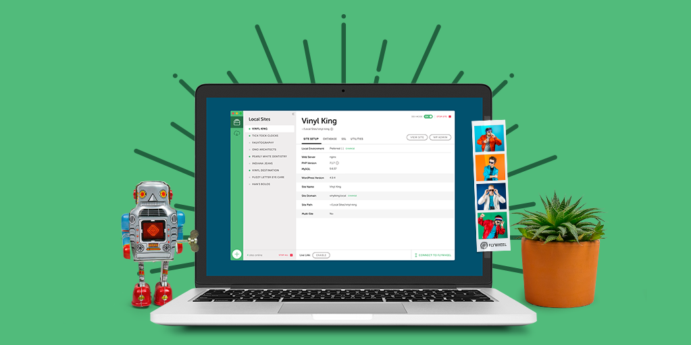

We all did it, we are all guilty, at some point in our careers we used MAMP. It was good enough, it was "magic" to have "an entire hosting server" on your computer for the first time. But then: it would crash, slow down your computer, etc, and you started to see its limitations, like being unable to create custom URL's for your local sites, install custom PHP modules, etc. For that, you had to pay, which at the time wasn't an option for me.

## The coolest guide on the planet

When I moved away from MAMP, I went through a few other ways to set up a fully customizable local dev environment, starting with the always up to date guide on [this site](https://coolestguidesontheplanet.com/install-apache-mysql-php-on-macos-catalina-10-15/)

It is a rather lengthy process of starting and stopping services, editing config files, installing MySQL, etc, but it works great, you can even add custom URLs by editing your hosts file and [enabling virtual hosts](https://coolestguidesontheplanet.com/set-up-virtual-hosts-on-macos-catalina-10-15-in-apache/).

**Pros:**

-   Uses Mac OS native Apache and PHP
-   It's a one time, fully customizable setup, call me crazy, but I find this stuff fun

**Cons:**

-   It breaks pretty much with every Mac OS update, and not only the major ones, you also have to make sure to backup cor configuration files and test after every update (or not update at all, which is a no-no for me)
-   It's a huge pain to install custom PHP modules (make && make install 🤮)
-   You can only use the PHP version included with Mac OS (i.e. 7.3.8 for Mac OS Catalina)

## Homebrew based local dev

Another option is to use the [awesome Homebrew tool](https://brew.sh/) to set up your local dev stack which eliminates the limitation of having to use whatever Apache and PHP versions are included with your current Mac OS.

Another advantage is that you can use a script to switch your PHP version if you need it.

The downside is that the setup process requires lots of steps, commands copy/pates and troubleshooting. For that reason, I won't be including the steps on this post, but keep reading!

**Pros:**

-   Homebrew is awesome
-   You can use any version of Apache and PHP
-   You can use PHP version switcher script
-   Local SSL support
-   You can use custom URLs and auto DNS (a new virtual host is created automatically when you add a new folder inside ~/SItes
-   Easy to add new PHP modules if needed, thanks to homebrew

**Cons:**

-   It also breaks, not as often as the previous alternative, but it does break
-   Setup is long and painful sometimes, easily 2 to 3 hours to get it up and running

## Local by Flywheel

Most devs, especially WordPress devs nowadays use Local by Flywheel. And why not? it has a clean interface, it allows you to switch between NGINX and Apache, PHP versions, local SSL support, one-click WordPress installation and more.

<div className="Image__Small">
    
</div>

Until now I've compared the alternatives above based on facts, now this is mostly if not entirely just a personal opinion with a hint of non-sense.

Don't get me wrong here, I highly recommend Local by Flywheel, go for it, install it, use it, forget about local dev stack. The end.

Unfortunately, my first impression with Local by Flywheel wasn't great. At the time, it ran using VirtualBox and Vagrant (I think) to create and manage your local dev buckets, which was super sloppy at best, and it used so much disk space. Besides, it didn't have a PHP version switcher, local SSL, etc.

For this I moved on and found the next alternative, which is my current one, it has been my local dev stack for more than a year now, so when I went to try Local by Flywheel again, I realized I had everything I needed already with Devil Box sans the pretty UI, which isn't a big deal for me.

**Pros:**

-   Nice clean UI
-   Shareable demo URLs
-   Hot-swap environments (change PHP and MySQL versions)
-   Dev tools (SSH and WP-CLI, log files, etc)
-   Local SSL
-   Custom local URLs
-   Super easy to use

**Cons:**

-   Not customizable
-   Not able to add PHP modules

## The Devil Box

As I mentioned above, in my quest for the perfect local dev stack I found The Devil Box. Before I dig into it, I'm going to define "perfect local dev stack".

A local dev stack has to be:

-   Lightweight
-   Easy to configure
-   Fully customizable
-   Portable
-   Open source, so, free

While looking for the perfect local dev stack, I decided to learn Docker by signing up for a course on Udemy. Everybody was talking about it and it seemed like a great viable alternative to Vagrant or VirtualBox. After doing about half of the course, I was able to create custom Docker containers and dockerize WordPress GitHub repos, which was a huge step forward for me.

Then I learned about some tools that make this process even easier, like [Lando](https://github.com/lando/lando) and [Devilbox](http://devilbox.org/).

I tested both, and Devilbox is the winner by far.

First of all, this is how you set it up:

-   Download and install Docker from [their official site](https://www.docker.com/products/docker-desktop)
-   Clone the repo

```shell
git clone https://github.com/cytopia/devilbox
```

-   Create docker-compose environment file

```shell
cd devilbox && cp env-example .env
```

-   Edit your configuration

```shell
 vim .env
```

-   That's it, you can start your devilbox

```shell
 code docker-compose up
```

In the configuration file you specify which version of PHP you want to use, MySQL or MariaDB, which version, Apache or NGINX, which version, the paths for your sites and database directories, etc. [For more details visit DevilBox site](http://devilbox.org/).

So here it goes, the list of pros and cons for Devilbox.

**Pros:**

-   Hot-swap environments (change PHP and MySQL versions)
-   Dev tools (SSH and WP-CLI, log files, etc)
-   Local SSL
-   Custom local URLs
-   Super easy to use
-   Auto DNS
-   Ability to customize php.ini files per PHP version
-   Easy to add PHP modules
-   Portable (I put my entire Devil box instance in a Dropbox folder so I had the same hosting setup, databases included, synched in both computers)
-   You can version control your config files (have a WordPress branch and a Magento one with different PHP configurations for example)
-   It includes most of the basic hosting tools like phpMyAdmin, Adminer, etc)
-   It's super easy to update, just pull the latest repo
-   It has great documentation

Cons:

-   No pretty UI

It is worth mentioning that the need for a more sophisticated local dev setup depends entirely on the developer's stack. Nowadays I'm slowly moving away from the good old LAMP stack to the coolest and fastest JAM stack, so custom PHP and Apache configurations are less of a necessity, but as far as I'm concerned, Devilbox is the way to go.
