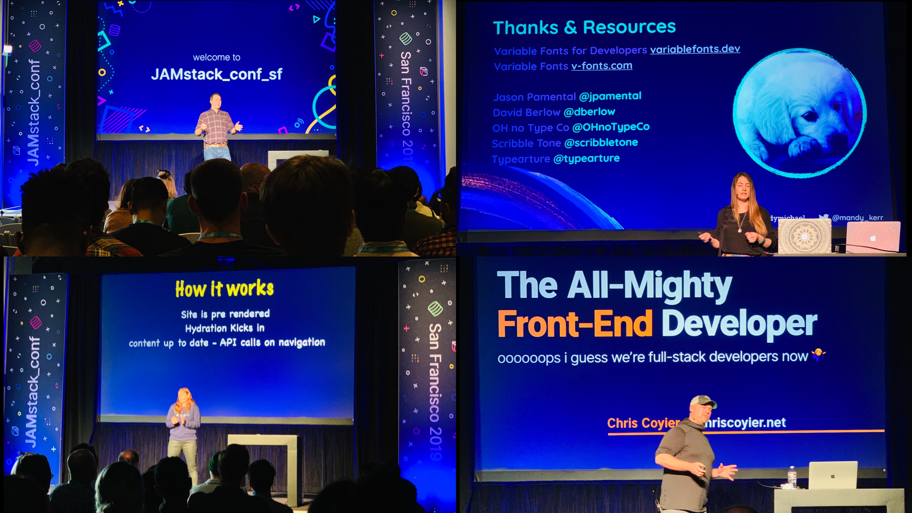

Towards the end of 2018, I decided to learn React. Of course, everybody is learning React nowadays, but at the time I had 5 or 6 years as a WordPress developer, so making the jump from PHP to JavaScript wasn't something I decided overnight.

> Learning React started a domino effect on my career as a developer:

* I purchased [Wes Bos's  "React for Beginners" course](https://reactforbeginners.com/)
* I subscribed to his [Syntax.fm podcast](https://syntax.fm/), which I now listen religiously every Monday and Wednesday
* I signed up for a [Level Up Tutorials](https://www.leveluptutorials.com/) account of Syntax.fm co-host Scott Tolinski
* I knew how disconnected I was from the web development world, and thanks to this podcast I felt motivated to re-join (more like "un-abandon") [my twitter account](https://twitter.com/RichardPastenes), as they made me realize that Twitter is a must to keep up with developers and new web tech.
* I cleaned up my twitter account of followers and following accounts I no longer cared about (I unfollowed about 1.400 accounts, mostly photography-related)
* I followed dozens if not more of other inspiring web developers like Wes and Scott
* I finished the React course and I fell in love with JavaScript
* I took Scott's Gatsby courses and I fell in love with Gatsby
* I attended [JAMstack_conf San Francisco](https://jamstackconf.com/) (more on this in a minute)
* I built my now ex-employer a blazing fast headless WordPress + Gatsby site
* I got promoted and eventually I accepted a job offer at another agency

At the point when I started using Twitter again, I got super motivated to set personal and career goals for that year (2019), but this time for real! By this I mean, not set goals that "I hope I get to reach them" and more like "I need to get some shit done to reach these goals!"

Here are those goals and their respective outcome:

## Learn either Vue or React

Originally I wanted to learn Vue, I even got some Udemy courses. I had chosen Vue over React because of, you know, Facebook, besides, the Vue logo is way cooler. But after some research, it was easy to see how all the big players were opting for React, and how little of Facebook React has. Yes, I find Facebook to be a shitty company, but I also see how the billions of dollars of this shitty company has brought us such cool techs like React and the GraphQL specification.

I got some React Udemy courses and completed one of them. In the end, I was as confused as I was when I started it. I commented on this to my good friend and mentor, and he mentioned Wes Bos as the to-go guy for React courses. He was so right.

Knowing what "state" and "props" were made me so proud! and also made me realize, in a positive way, that there are so many JavaScript concepts I need to learn.

Goal achieved ✔

## Start Going to Meetups, AKA Talk to More People

I'm an introvert, and as such, I recharge by being alone, ergo, it's exhausting for me to socialize too much. This, by the way, is the proper definition of  "introvert". Introvert  ≠ Shy. So I had been avoiding Meetups of any kind for this reason primarily, and secondarily because none of the Web-related meetups sounded exciting, not even the WordPress ones!

### Enter the JAMstack

One of the last chapters on one of Scott Tollinski's Gatsby tutorials, he talked about this "Netlify thing", which once I used, I never looked back. Such an awesome service! anyways, because I created my Netlify account and opted in for their newsletter, I got the email letting me know about the San Francisco JAMstack_conf. I pitched this conference to my employer and they sponsored me to assist. And it was epic.

    

The day before the conference we had a Meetup, the San Francisco JAMstack Meetup. I got to geek out with really cool dudes and gals about anything web dev and listen to some fun flash talks about web components, Gatsby as a create-react-app replacement and others, while enjoying free food and beer.

Goal achieved ✔

## Start a blog

I used to blog back in my college days in Chile. I used to blog about photography and random stuff, mostly random stuff. A couple of years ago I started using an app called Quiver, which is to document any coding related topics. I noticed I started to write mini-tutorials on how to do things I learned that day. That plus the need to experiment more with Gatsby,  React and Netlify, the desire to share some of those mini-tutorials and the sense of accomplishment that comes with writing your own blog, I decided to make it a goal. Well, you are reading it.

Goal achieved ✔

## Contribute to open source code

GitHub is part of every developer's day-to-day. I was a lurker and I wanted to know more about these "issues" and "pull requests". I had no idea how to get into this, as the things that interested me were all new to me, I didn't feel confident to contribute code to projects such as Gatsby or TinaCMS. But again, thanks to twitter, I saw a tweet about Gatsby needing help translating their documentation. I know Spanish, they had a GitHub issue for the translation,  contributors must submit pull request for the code maintainers to accept the translations, presto, I'm contributing to open source code!

I've had half a dozen or so pull requests merged to Gatsby's master branch, including the Gatsby Cheat Sheet which will be shared and printed by so many Spanish speaking developers. I even got free Gatsby swag!

Goal achieved ✔

## Get more involved with web development

I didn't exactly know how to do this, it just happened. Twitter, conferences and podcasts being the main source of motivation and information for anything web related, not only development but design, new standards, and best practices. 

Going to the JAMstack_conf allowed me to meet and hang out with such cool humans, to name a few: Matt Billmann, CEO of Netlify, Chris Coyer, founder of CSS-Tricks and Codepen, Dave Ruppert, co-host of the Shop Talk Show podcast, Debbie O'Brien, speaker at JAMstack conf, Mandy Michael, speaker at JAMstack conf and so many other talented people.

The best part of all of this is that I would love to do this all over again.

Goal achieved ✔

> “The secret of change is to focus all of your energy, not on fighting the old, but on building the new.” —Socrates

## What's next

I want more. So I need more goals. The motivation is still there and I think I know what I have to do to keep it alive: continue being involved in web dev as much as I possibly can.

# Here are my goals for 2020:
1. Master JavaScript: by feeling fully comfortable with the language at the point of wanting more. I purchased Wes Bos's "Beginner JavaScript" course that covers everything I need and wants to learn. I feel like achieving this goal will help me considerably with frameworks such as React. 
2. Level Up my React skills: I still consider myself new to React. I want to build more complex and customized web apps with Gatsby. Learning and practicing React is key.
3. Continue attending meetups: I'm looking forward to the local JAMstack meetup and other JavaScript and React related ones.
4. Attend at least one conference: I have attended one conference in my life so far, and the first impression was amazing. I need to attend another conference to keep this motivation and excitement alive and meet up with more cool talented people.
5. Touch-type properly: this is the embarrassing one, not only because y don't touch-type properly at my 40's, but because this was a 2019 goal I didn't achieve. I have valid excused though, like the impossibility to find the time to practice and having this as a low priority goal, but I can say I'm halfway done with this goal and I expect to be a better typer by end of Q1.
6. Write at last one blog post a month: I mentioned on my first post that this blog is for me, it's my personal record keeping of my career achivements and discoveries and it's also part of what keeps my motivation alive. A post a month at the least seems a reasonable goal.

Future me, read this and keep me accountable.

